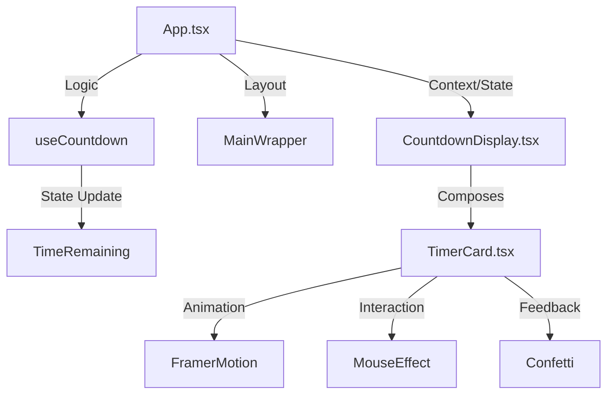

# New Year Countdown Timer (React Migration)

A modern, high-performance countdown timer built with React 18, TypeScript, Tailwind CSS, and Framer Motion.

## 🚀 Quick Start

```bash
# Install dependencies
npm install

# Start development server
npm run dev
```

## 🏗 Architecture



## 🧩 Components & Props

### `<TimerCard />`

Presentation component for a single time unit (Days, Hours, etc.).

| Prop | Type | Default | Description |
|------|------|---------|-------------|
| `value` | `number` | **Required** | The numeric value to display. |
| `label` | `string` | **Required** | Label text below the number (e.g., "Days"). |

### `<CountdownDisplay />`

Layout container that orchestrates the four `TimerCard` components using the `useCountdown` hook.

## 🎨 Customization

The theme is built with Tailwind CSS. You can customize the primary colors in `tailwind.config.ts`:

```typescript
// tailwind.config.ts
export default {
  theme: {
    extend: {
      colors: {
        countdown: {
          primary: 'hsl(24, 100%, 68%)',  // Main gradient start
          secondary: 'hsl(30, 97%, 74%)', // Main gradient end
          glow: 'hsl(51, 100%, 50%)',     // Glow effects
        }
      }
    }
  }
}
```

## ✨ Features

- **Strict Typing**: Full TypeScript coverage with no `any`.
- **Performance**: 60fps animations using GPU-accelerated transforms.
- **Glassmorphism**: Premium frosted glass effect using `backdrop-filter`.
- **Micro-interactions**: 
  - Physics-based spring hover effects.
  - Mouse-tracking gradient glow.
  - Confetti burst on click and New Year arrival.
